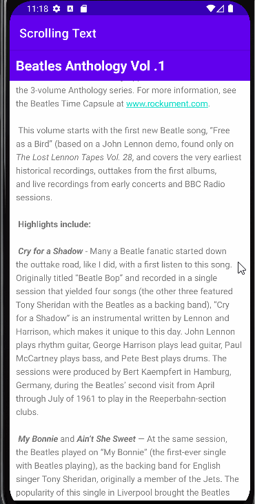
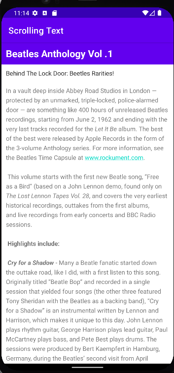
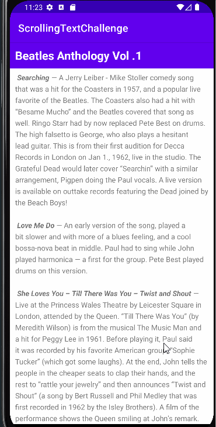
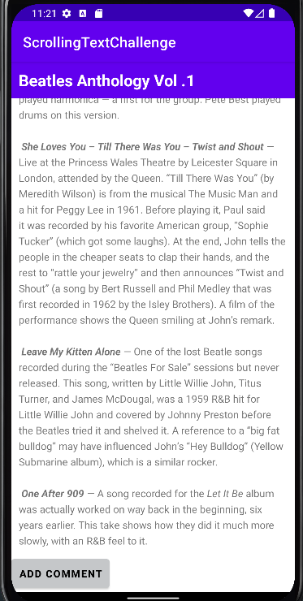
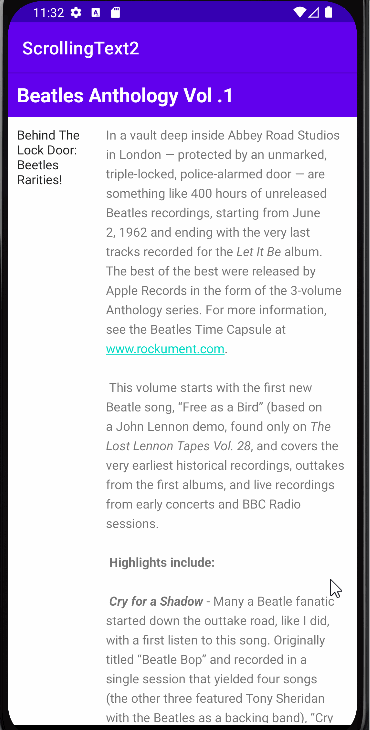
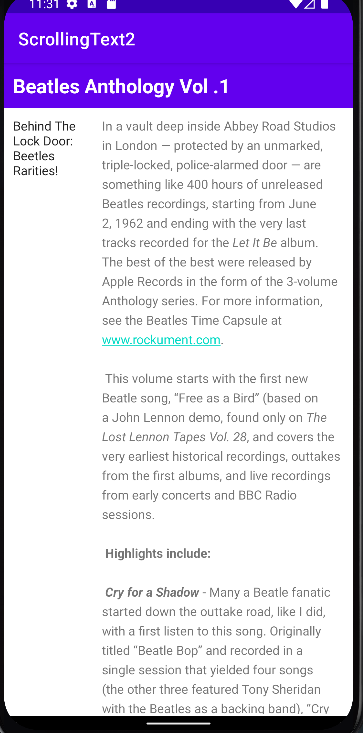

# Text-and-scrolling-views

## Tasks

The Scrolling Text app demonstrates the ScrollView UI component.It shows a lengthy page of text—in this case, a music album review—that the user
can scroll vertically to read by swiping up and down.A scroll bar appears in the right margin. The app shows text formatted with minimal HTML tags
for setting text to bold ,and with new-line characters to separate paragraphs, also included active web links in the text.

Scrolling Text

## Coding-Challenge
Added a Button to the LinearLayout inside the ScrollView so that it scrolls with the text.

Scrolling Text Challenge

## Homework

Changing the subheading so that it is wrapped within a column on the left and the text of the article to the right of the subheading

Scrolling Text Homework

## Answer these questions

### Question 1
How many views can you use within a ScrollView?

Ans - One view only

### Question 2
Which XML attribute do you use in a LinearLayout to show views side by side?

Ans - android:orientation="horizontal"

### Question 3
Which XML attribute do you use to define the width of the LinearLayout inside the scrolling view? 

Ans - android:layout_width="match_parent"

